# Autonomous ML-based detection and identification of root cause for incidents in microservices running on EKS

Hello! Welcome to this exciting project where we will be going further in depth on how we can use autonomous machine learning (ML) to detect and identify the root cause for incidents in microservices running on EKS.

# Introduction

Have you ever had to search through huge volumes of code/documents/logs to locate the origin of your syntax or logical error? Maybe this led to you dedicating an unexpected amount of time troubleshooting the problem––which was not in the cards. If you have, you may understand how tedious and frustrating a process like that can be! Unfortunately the more the technology industry and apps grow, the more complicated it becomes to diagnose the root cause.

In order to alleviate some of these pain points, we'll walkthrough an approach that utilizes the [Zebrium](https://www.zebrium.com/) machine learning platform to automatically discover the root cause in logs generated by an application deployed in [Amazon EKS](https://aws.amazon.com/eks/).

Are you ready? Let's begin!

## Getting Started

In order to complete this project, ensure that you have active accounts with the following services:

1. An active AWS account.
2. AWS CLI with the IAM user having admin permission or having all the permissions to execute the setup.
3. A free Zebrium trial account.

### 1. An active AWS account

You'll need to login to your AWS console. It's recommended that you sign-in with the **IAM user**, having admin permission or having all the permissions needed to execute this setup. You can do this on the AWS management console. If you don't have an account created yet, you can do so [here](https://us-east-1.console.aws.amazon.com/console/home).

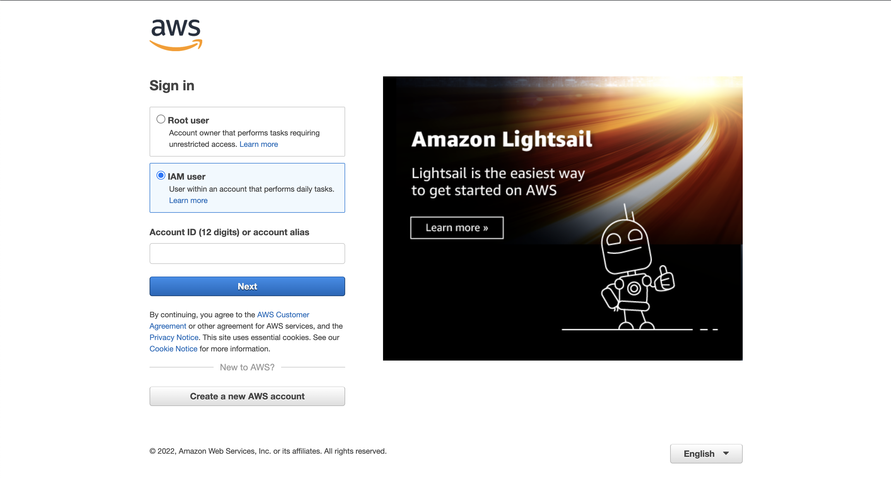

### 2. AWS Command Line Interface (CLI)

Make sure that you have the latest version of AWS CLI installed on your local PC. If you don't have it installed at all, follow this [link](https://docs.aws.amazon.com/cli/latest/userguide/install-cliv2.html)] to install the software on your local PC. Confirm the installation and version with the following command:

    $ aws --version

1

Use the command below to configure your AWS account:

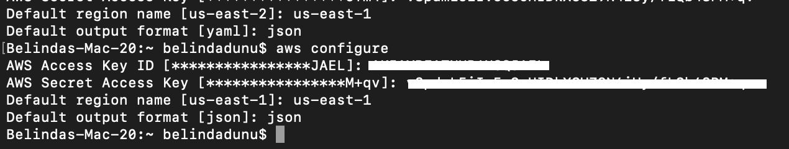

### 3. Create and configure an EKS cluster

We'll first need to navigate back to our AWS console and search for *IAM*. Select *IAM* to navigate to its console. 

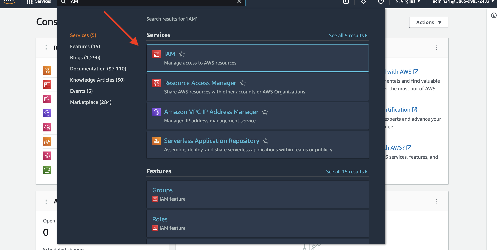

Navigate to the **Roles** section within the **Access Management** category. Then **Create role**. 

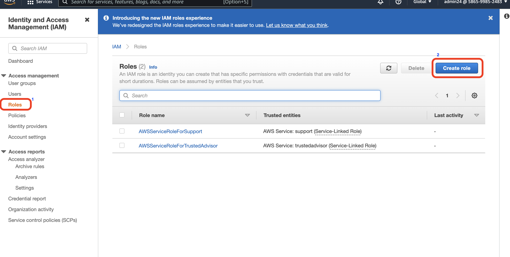

Under **Select trusted entity**, select **AWS service**. Under *Use cases for other AWS services*, select **EKS**. then the **EKS - Cluster** for your use case.

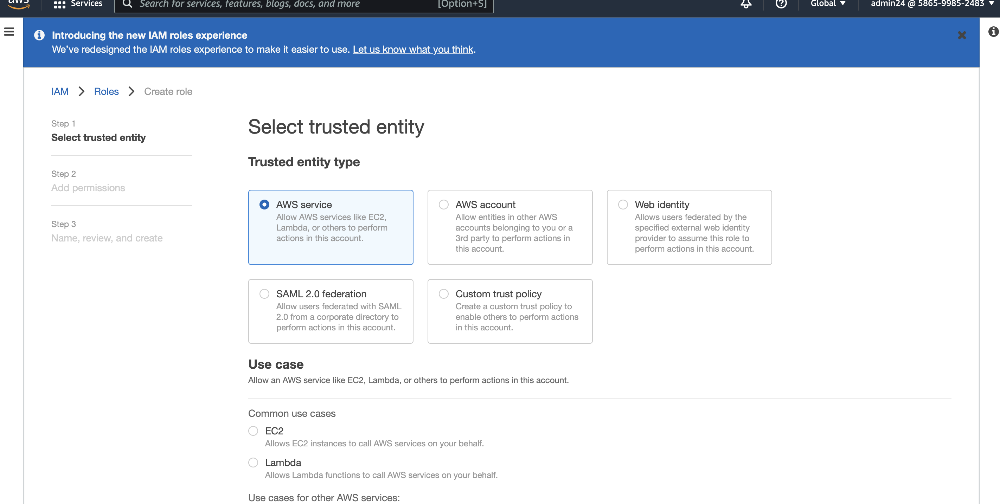

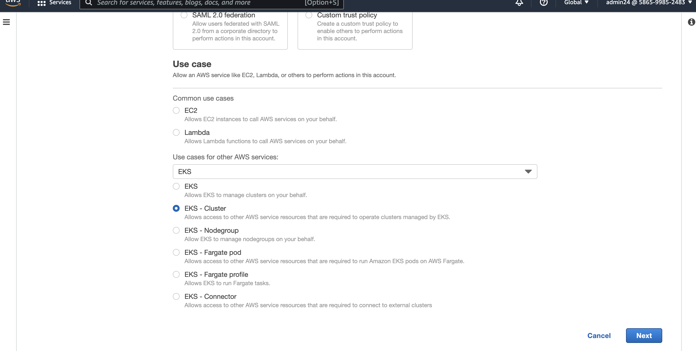

On the *Add permissions* page, the **AmazonEKSClusterPolicy** is added by default––leave as is, and select **Next**.

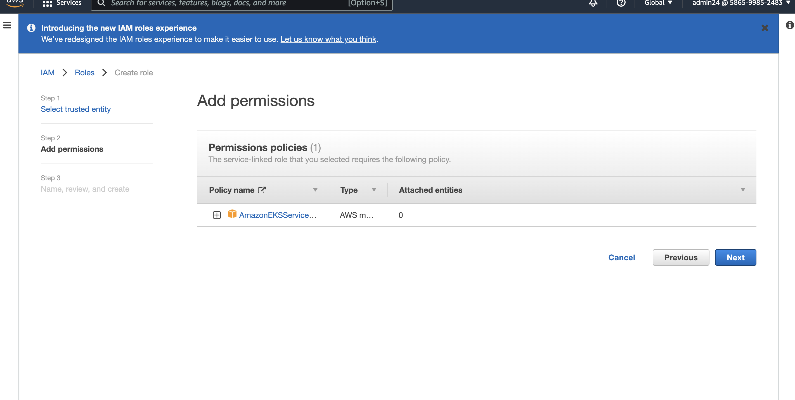

On the **Name, review and create** page, give your role a name and description (optional). Scroll to the bottom of the page and select **Create role**.

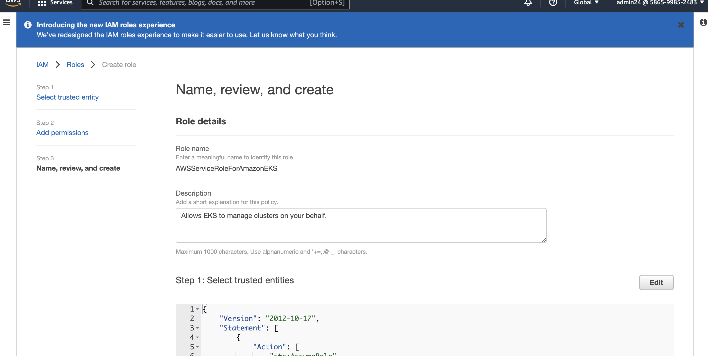

Once the page refreshes, you should now be able to view your newly created role.

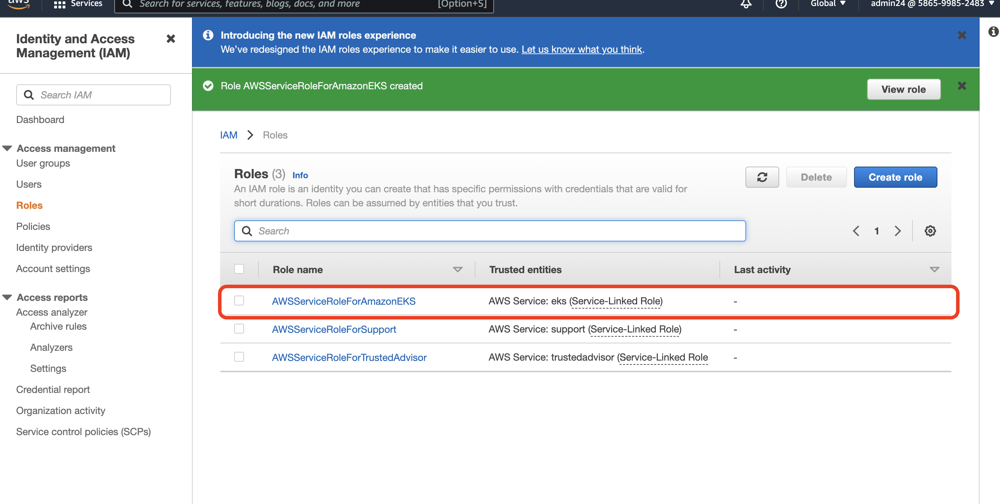

To create a cluster, head back to the search bar, and search for **Elastic Kubernetes Service**. If you've never created one before, you can also follow this [link](https://www.eksworkshop.com/030_eksctl/) to get started. 

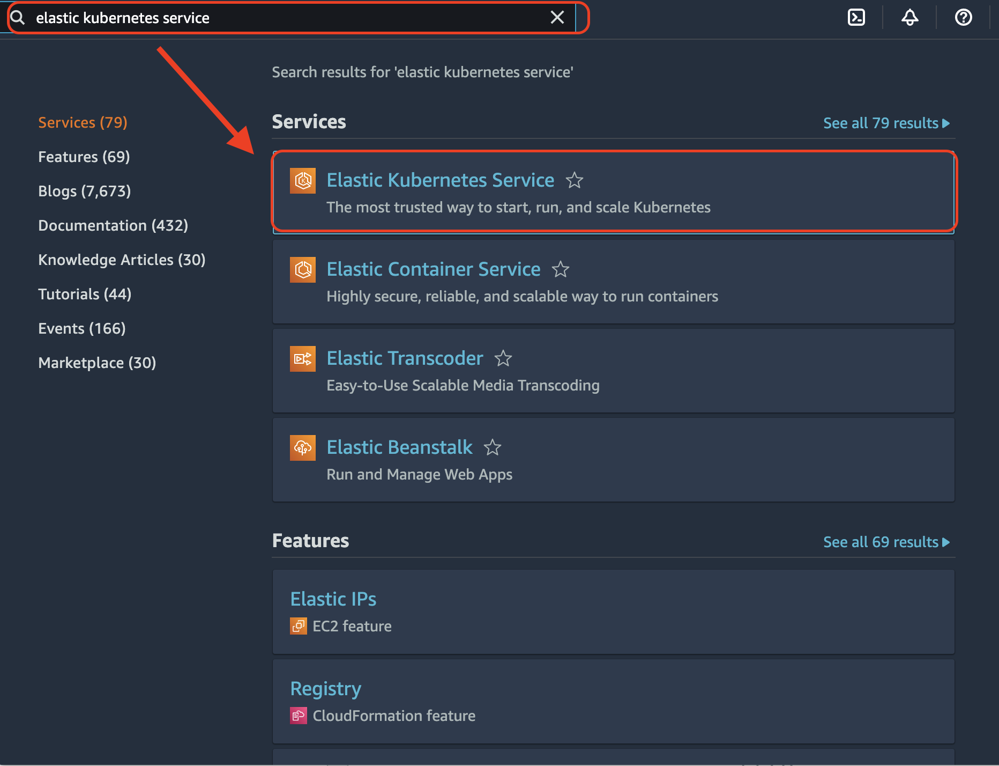

Click Add cluster and follow the steps to create a cluster.

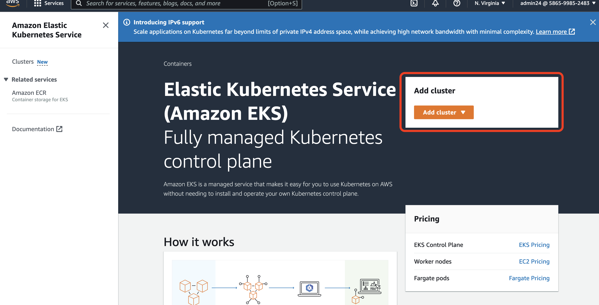

Once our cluster is active, we'll need to add permissions to the it by creating a nodegroup.

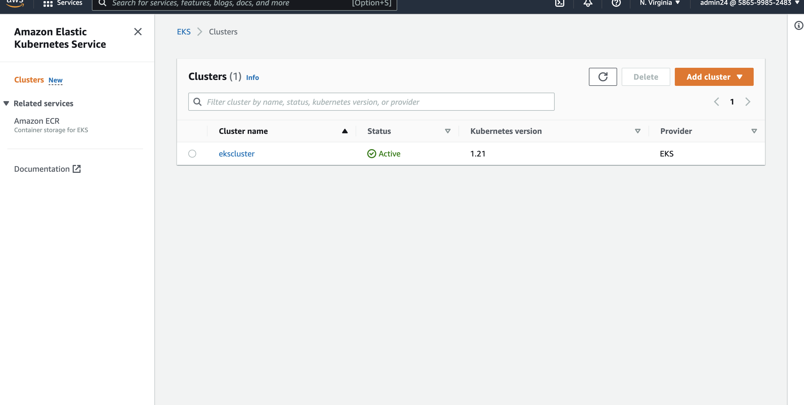

Navigate back to the *IAM* service on the AWS Management Console. Select the **Roles** section within the **Access Management** category to create a role.

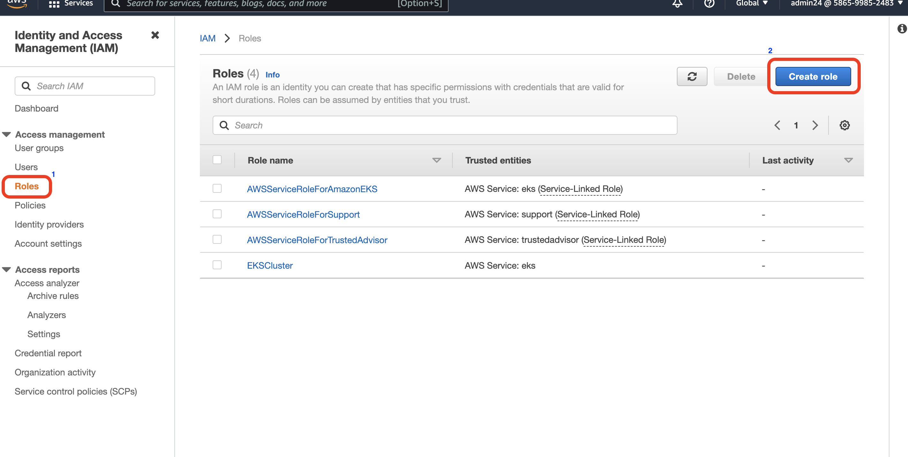

Next, select **AWS Service** and then select **EC2** as the use case. Then scroll to the bottom page to go head to the next screen.

Add the following permission policies:

    AmazonEKSWorkerNodePolicy
    AmazonEKS_CNI_Policy
    AmazonEC2ContainerRegistryReadOnly

Once you secelct *next*. Enter your preferred Role Name and/or Description. Once you scoll to the bottom of the page, you'll notice all three permissions have been added!

Finalize your setup by crrating the cluster.

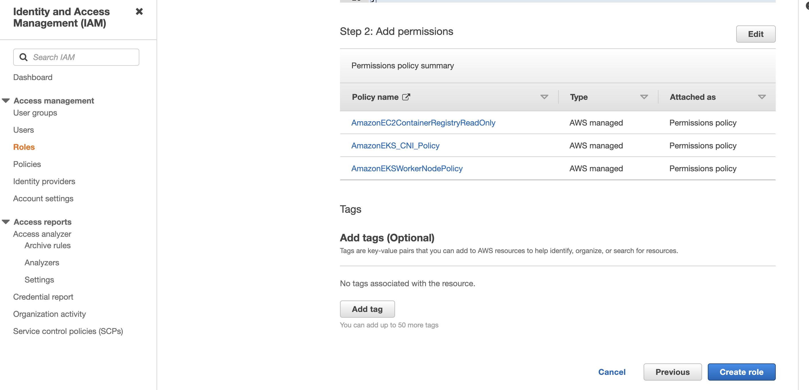

After you have completed the steps above, navigate back to the cluster on Amazon EKS. Click the **Configuration** tab, followed by the **Compute**. Then select **Add Node Group**.

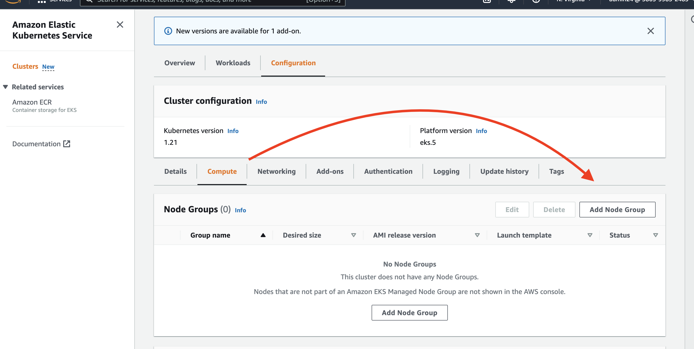

Next, begin to configure and add the newly created node group to your cluster.

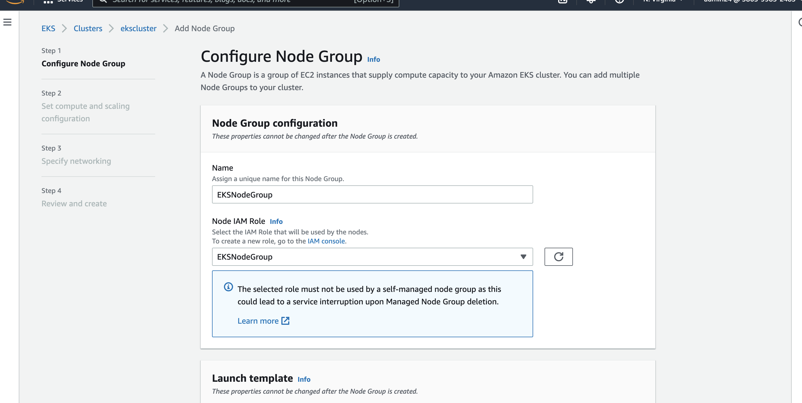

Once added it, you should see the node group in your cluster:

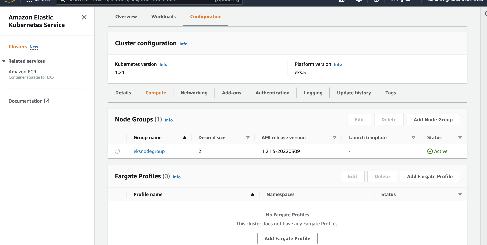

### Step 2. Create a Zebrium account and install the log collector

We can create a new Zebrium account by signing up for a free trial [here](https://cloud.zebrium.com/auth/sign-up). Set a password and then head to the **Send Logs** page.

**PLEASE NOTE:** *Do not* install the log collector yet. We'll need to modify the install command first!

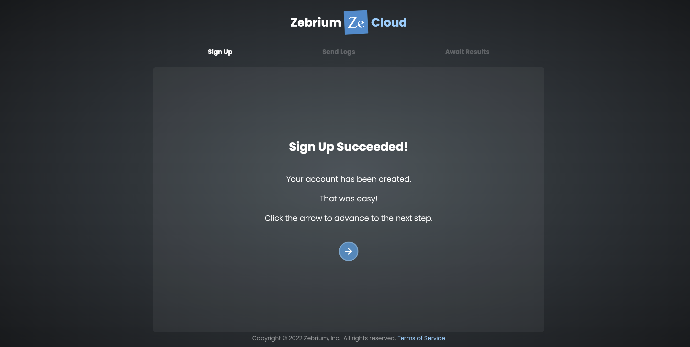

On the Log Collector Setup page, copy the Helm command from the Zebrium Send Logs page.

**PLEASE NOTE:** Do not install the log collector just yet. We will modify it in the upcoming steps!

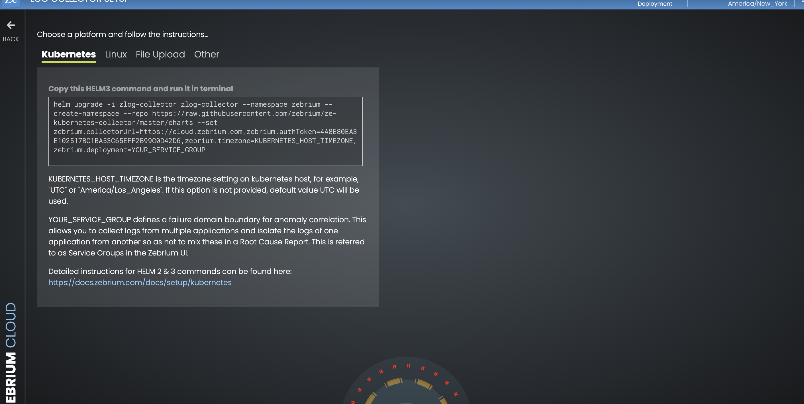

In the Helm command you copied, delete the following parts of the line:

    zebrium.timezone=KUBERNETES_HOST_TIMEZONE
zebrium.deployment=YOUR_SERVICE_GROUP

COpy the Helm command from the **Zebrium Send Logs** page.

**PLEASE NOTE:** You can cut out this portion of the code:

    zebrium.timezone=KUBERNETES_HOST_TIMEZONE,zebrium.deployment=YOUR_DEPLOYMENT_NAME

Below is what we have once the above portion has been removed. (make sure to substitute XXXX for your actual token):

helm upgrade -i zlog-collector zlog-collector --namespace zebrium --create-namespace --repo https://raw.githubusercontent.com/zebrium/ze-kubernetes-collector/master/charts --set zebrium.collectorUrl=https://cloud-ingest.zebrium.com,zebrium.authToken=XXXX

