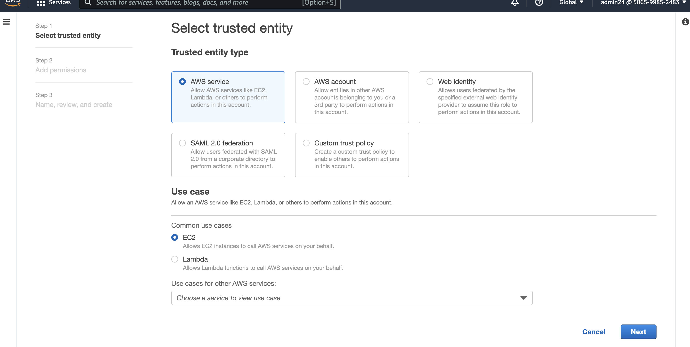

# Autonomous ML-based detection and identification of root cause for incidents in microservices running on EKS

Hello! Welcome to this exciting project where we will be going further in depth on how we can use autonomous machine learning (ML) to detect and identify the root cause for incidents in microservices running on EKS.

# Introduction

Have you ever had to search through huge volumes of logs to locate the origin of your syntax or logical error? Maybe this led to you dedicating an unexpected amount of time troubleshooting the problem––which was not in the cards. If you have, you may understand how tedious and frustrating a process like that can be! Unfortunately the more the technology industry and apps grow, the more complicated it becomes to diagnose the root cause.

In order to alleviate some of these pain points, we'll walkthrough an approach that utilizes the [Zebrium](https://www.zebrium.com/) machine learning platform to automatically discover the root cause in logs generated by an application deployed in [Amazon EKS](https://aws.amazon.com/eks/).

Are you ready? Let's begin!

## Getting Started

In order to complete this project, ensure that you have active accounts with the following services:

1. An active AWS account.
2. AWS CLI with the IAM user having admin permission or having all the permissions to execute the setup.
3. A free Zebrium trial account.

### 1. An active AWS account

You'll need to login to your AWS console. It's recommended that you sign-in with the **IAM user**, having admin permission or having all the permissions needed to execute this setup. You can do this on the AWS management console. If you don't have an account created yet, you can do so [here](https://us-east-1.console.aws.amazon.com/console/home).

### 2. AWS Command Line Interface (CLI)

Make sure that you have the latest version of AWS CLI installed on your local PC. If you don't have it installed at all, follow this [link](https://docs.aws.amazon.com/cli/latest/userguide/install-cliv2.html)] to install the software on your local PC. Confirm the installation and version with the following command:

    $ aws --version

1

Use the command below to configure your AWS account:

### 3. Create and configure an EKS cluster

We'll first need to navigate back to our AWS console and search for *IAM*. Select *IAM* to navigate to its console. 

Navigate to the **Roles** section within the **Access Management** category. Then **Create role**. 

Under **Select trusted entity**, select **AWS service**. Under *Use cases for other AWS services*, select **EKS**. then the **EKS - Cluster** for your use case.

On the *Add permissions* page, the **AmazonEKSClusterPolicy** is added by default––leave as is, and select **Next**.

On the **Name, review and create** page, give your role a name and description (optional). Scroll to the bottom of the page and select **Create role**.

Once the page refreshes, you should now be able to view your newly created role.

To create a cluster, head back to the search bar, and search for **Elastic Kubernetes Service**. If you've never created one before, you can also follow this [link](https://www.eksworkshop.com/030_eksctl/) to get started. 

Click Add cluster and follow the steps to create a cluster.

Once our cluster is active, we'll need to add permissions to the it by creating a nodegroup.

Navigate back to the *IAM* service on the AWS Management Console. Select the **Roles** section within the **Access Management** category to create a role.

Next, select **AWS Service** and then select **EC2** as the use case. Then scroll to the bottom page to head to the next screen.

Add the following permission policies:

    AmazonEKSWorkerNodePolicy
    AmazonEKS_CNI_Policy
    AmazonEC2ContainerRegistryReadOnly

Once you secelct *next*. Enter your preferred Role Name and/or Description. Once you scoll to the bottom of the page, you'll notice all three permissions have been added!

Finalize your setup by creating the cluster.

After you have completed the steps above, navigate back to the cluster on Amazon EKS. Click the **Configuration** tab, followed by the **Compute**. Then select **Add Node Group**.

Next, begin to configure and add the newly created node group to your cluster.

Once added it, you should see the node group in your cluster:

### Step 2. Create a Zebrium account and install the log collector

We can create a new Zebrium account by signing up for a free trial [here](https://cloud.zebrium.com/auth/sign-up). Set a password and then head to the **Send Logs** page.

**PLEASE NOTE:** *Do not* install the log collector yet. We'll need to modify the install command first!

On the Log Collector Setup page, copy the Helm command from the Zebrium Send Logs page.

**PLEASE NOTE:** Do not install the log collector just yet. We will modify it in the upcoming steps!

In the Helm command you copied, delete the following parts of the line:

    zebrium.timezone=KUBERNETES_HOST_TIMEZONE,zebrium.deployment=YOUR_DEPLOYMENT_NAME

Copy the Helm command from the **Zebrium Send Logs** page.

**PLEASE NOTE:** You can cut out this portion of the code:

    zebrium.timezone=KUBERNETES_HOST_TIMEZONE,zebrium.deployment=YOUR_DEPLOYMENT_NAME

Below is what we have once the above portion has been removed. (make sure to substitute XXXX for your actual token):

    helm upgrade -i zlog-collector zlog-collector --namespace zebrium --create-namespace --repo https://raw.githubusercontent.com/zebrium/ze-kubernetes-collector/master/charts --set zebrium.collectorUrl=https://cloud-ingest.zebrium.com,zebrium.authToken=XXXX

**TROUBLESHOOTING:** If you receive an "Error: Kubernetes cluster unreachable" message as an output to the above command, try configuring kubectl so that you can connect to your Amazon EKS cluster:

    $ aws eks --region <REGION> update-kubeconfig --name <EKSClusterName>

    $ kubectl get svc

The Zebrium UI should detect that logs are being sent within a minute or two. Once received, you’ll see a message like this:

The Zebrium installation and setup is now complete! The machine learning will begin structuring and learning the patterns in the logs from your newly created K8s (Kubernetes) environment.

### Step 3. Install and fire up the Sock Shop demo app

[Sock Shop](https://microservices-demo.github.io/) is a really good demo microservices application as it simulates the key components of the user-facing part of an e-commerce website. It is built using Spring Boot, Go kit, and Node.js and is packaged in Docker containers. Visit this [GitHub page](https://github.com/microservices-demo/microservices-demo/blob/master/internal-docs/design.md) to learn more about the application design.

Later down the line, we'll install and use the [Litmus Chaos Engine](https://litmuschaos.io/) to “break” the Sock Shop application. So, we are now going to install Sock Shop using a YAML config file that contains annotations for the Litmus Chaos Engine.

    $ kubectl create -f https://raw.githubusercontent.com/zebrium/zebrium-sockshop-demo/main/sock-shop-litmus-chaos.yaml

Then: 

    $ kubectl get pods -n sock-shop

Wait until all the pods are in a running state (this can take a few minutes!).

Once all the services are running, you can bring up the app in your browser. You will need to set up port forwarding and get the front-end IP address and port by running the command below:

Get pod name of front-end:

    $ kubectl get pods -n sock-shop | grep front-end

**Run port forward in a new shell window.** Use the pod name from the above command in place of XXX’s

    $ kubectl port-forward front-end-XXXX-XXXX 8079:8079 -n sock-shop

Now open the ip_address:port from above (in this case: 127.0.0.1:8079) in a new browser tab. You should now be able to interact with the Sock Shop app in your browser and verify that it’s working correctly.

Alternatively can navigate to CloudWatch in the AWS Console and visit the Resources page under Container Insights to verify that everything looks healthy. Details on how to do this can be found at the [Amazon CloudWatch User Guide](https://docs.aws.amazon.com/AmazonCloudWatch/latest/monitoring/deploy-container-insights-EKS.html).

### Step 4. Install the Litmus Chaos Engine

We’re going to use the open-source Litmus chaos tool to run a chaos experiment that “breaks” the Sock Shop app. Install the required Litmus components using the following commands:

    $ helm repo add litmuschaos https://litmuschaos.github.io/litmus-helm/

    $ helm repo add litmuschaos https://litmuschaos.github.io/litmus-helm/

    $ kubectl apply -f "https://hub.litmuschaos.io/api/chaos/1.13.6?file=charts/generic/experiments.yaml" -n sock-shop

Setup service account with the appropriate RBAC to run the network corruption experiment

    $ kubectl apply -f https://raw.githubusercontent.com/zebrium/zebrium-sockshop-demo/main/pod-network-corruption-rbac.yaml

Now, make note of the current time:

    $ date

### Step 5. Take a two hour break!

This is a new EKS cluster, a new app and Zebrium account, so it is important to give machine learning a bit of time to learn the normal log patterns. It is best practice to wait at least two hours before proceeding with the next steps.

You can use this time to explore the Zebrium UI.

On the REPORTING page, you should see at least one sample root cause report.

### Step 6. Running a network corruption chaos experiment to break the Sock Shop app.

Now that the ML has had a chance to get a baseline of the logs, we’re going to break the environment by running a Litmus network corruption chaos experiment. You can read about the details of what the experiment does [here](https://github.com/litmuschaos/github-chaos-actions/blob/master/experiments/pod-network-corruption/README.md).

The command below will start the network corruption experiment:

    $ kubectl apply -f https://raw.githubusercontent.com/zebrium/zebrium-sockshop-demo/main/pod-network-corruption-chaos.yaml

Make note of the date:

    $ date

Get the experiment started by running:

    $ kubectl get pods -n sock-shop -w

It takes awhile for the experiment to start, so you have to wait until the pod-network-corruption-helper goes into a Running state. Enter *^C (Shitft + Command)* once everything is running.

 to the Sock Shop UI. You should still be able to navigate around and refresh the app but might notice some operations will fail.

 

 The chaos test will run for two minutes. Wait for it to complete before proceeding to the next step.

 If the browser does not show up, rerun the command below in a different terminal:

    $ $ kubectl port-forward front-end-XXXX-XXXX 8079:8079 -n sock-shop

The chaos test will run for two minutes, wait for it to complete before proceeding to the next step.

### Step 7. The results and how to interpret them

Now that the chaos experiment is complete, please allow some time for the Zebrium ML platform to detect the errors. This may take up to 10 minutes. Then, refresh your browser windows until you see one or more new root cause reports (UI refresh is not automatic).

The type of errors that appear are based on a combination of many factors. This includes the learning period, the events occurred while learning, and the timing/order of the log lines while the experiment was running, and so forth.

The reporting page contains a summary list of all the root cause reports found by the machine learning. There are three useful parts of the summary:

1. Plain language NLP summary  This is an experimental feature where we use the GPT-3 language model to construct a summary of the report. The summary provides some useful context about the problem.

2. Log type(s) and host(s) The log type and host (front end, events, orders, and messages) that contain the events for the incident.

3. “Hallmark” events The ML picks out one or two events that it believes will define the problem.

After running the Chaos experiment, Zebrium generated a series of reports. Here is a summary of the root cause errors that were generated in my Zebrium account:

Clicking on the summary lets you drill down into the details of the root cause report. Initially, you see only the core events. The core events represent the cluster of correlated anomalies that the ML picks out. There are many factors that go into anomaly scoring, but the most important ones are events that are either “rare” or “bad” (events with high severity).

The displayed core events represent the cluster of correlated anomalies that the Zebrium ML selected. I zoomed-in to view more details of the root cause report.

Each zoom level displays additional surrounding errors and anomalies that the Zebrium ML believes are related. Here are the logs I observed after I clicked on the next zoom level:

It’s interesting to note the variance in the structure of these events. Fortunately, the ML automatically learns how to parse, structure, and categorize each different type of event!

### Conclusion

The process of troubleshooting and tracking down the root cause of an incident in a distributed application is becoming more and more difficult and time-consuming.

In this project, we utilized the principles of Chaos Engineering to deliberately "break" the Sock Shop microservices application. The Zebrium machine learning technology was able to detect this and build a root cause report that detailed the root cause.

The Zebrium ML platform was able to detect and outline the root cause of the issue. This powerful technology demonstrates how machine learning can be used to automatically detect anomalies within a set of log lines and define the root cause.

### Cleaning up

To avoid charges on our AWS account for resources we are no longer using, we need to delete them.

Navigate to the 'Amazon EKS' console. Under 'Clusters', click on the cluster you created.

Next, in the 'Configuration' tab, select the 'Compute' tab and then delete the node group.

You will be prompted to confirm whether or not you want to delete the node groups. Confirm by typing the name of the node group, then click 'Delete'.

